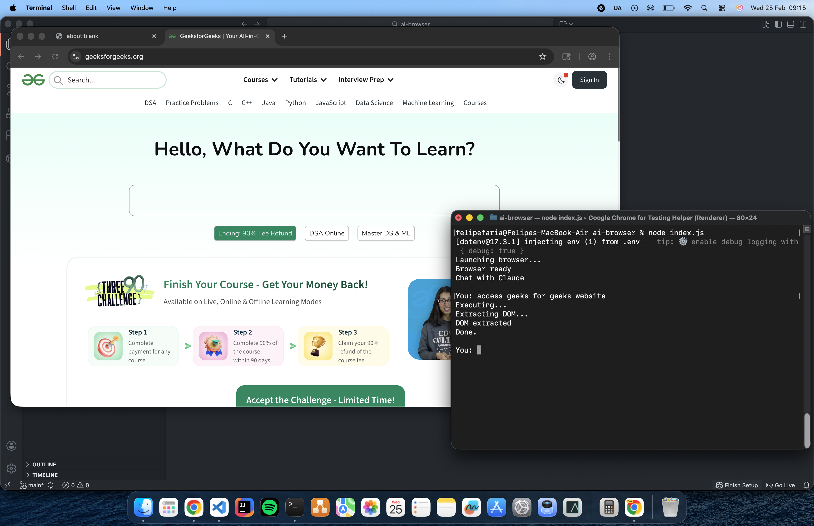
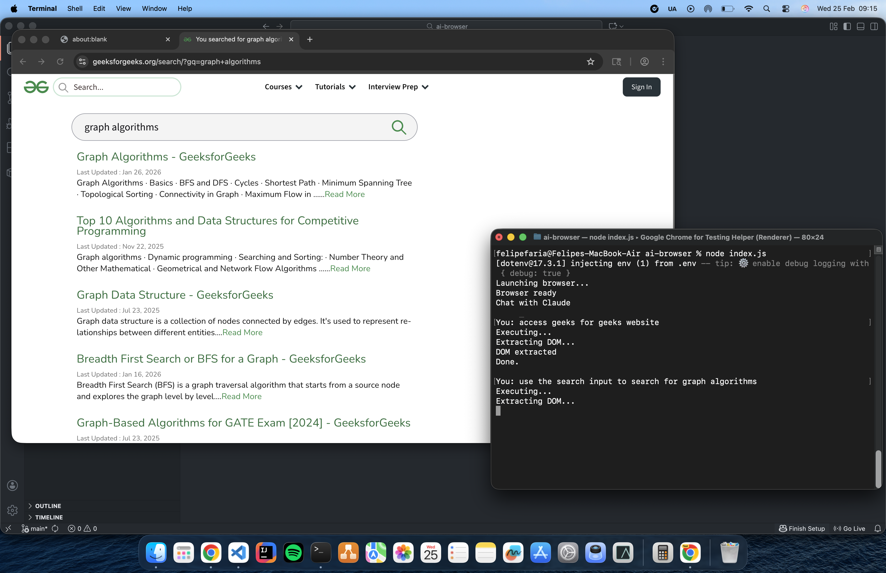
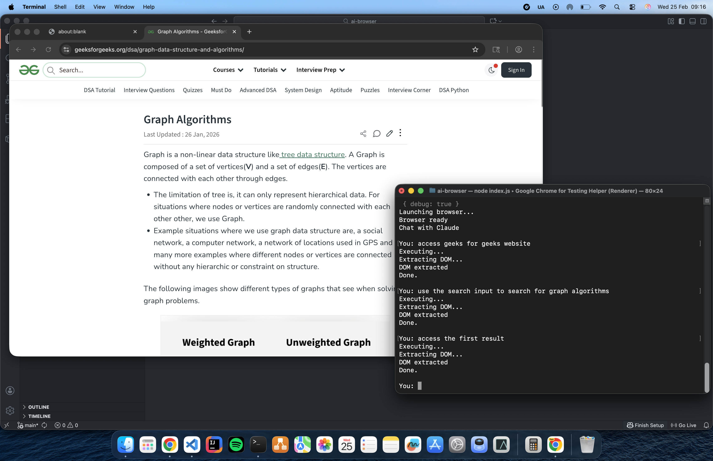

# AI Browser

This POC implementes a node.js terminal chat used to control a browser integrated with AI. 
User gives instructions about a website to be accessed and how to nagivate through this website. The AI is used to generate the puppeteer code that executes the user instructions.

This implementations has several problems: it's lazy, expensive, and unsecure. 
So what's the motivation? Replace the terminal promps by voice commands and we could have some starting point to automate browsers for people with disabilities nagivate through the internet.

## How it works

```pseudocode
FUNCTION RunAutomation():
    browser ← LaunchBrowser()

    whilte true:
        pageHtml ← GetCurrentPageHTML(browser)

        userInstructions ← GetUserInput()

        aiPrompt ← BuildPrompt(
            instructions = userInstructions,
            htmlContext = pageHtml
        )

        generatedCode ← AskAIForPuppeteerCode(aiPrompt)

        ExecutePuppeteerCode(browser, generatedCode)
```

### How to execute code generated by AI?

Using javascript Function class

```js
async function executeCode(code) {
  const fn = new Function("browser", "page", `return (async () => { ${code} })();`);
  return await fn(browser, page);
}
```

## Experiment and results

In my experiment I attempt to:

- Access Geeks for Geeks website;
- Search for Graph Algorithms;
- Access the first result.

I ran same script ten times and it worked in five of the attemps with no problem, in two attemps I had to try twice the instruction, in the other three I gave up.

Access Geeks for Geeks website


Search for Graph Algorithms


Access the first result


