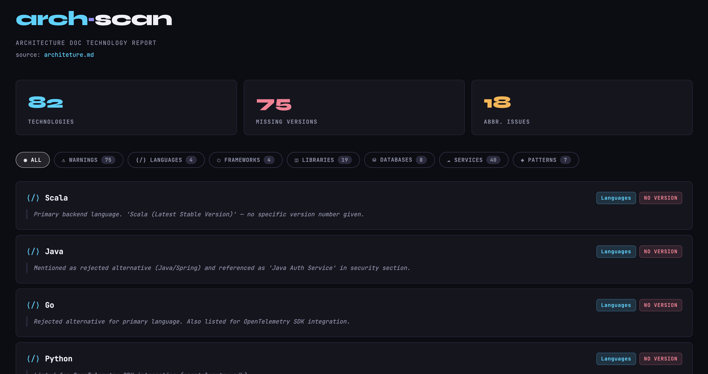

# AI Skill

Evaluate architecture .md files and list all technologies.

* Classify the tech by languages, frameworks, libraries, services, plugins, patterns, database;
* Find errors like missed versions, abbreviation without expanded name;
* Open the results in a HTML file with the statistics features for filtering.

**How to use**

* Copy the `SKILL.md` and the `template.html` to a folder `arch-scan` inside your claude skills folder `~/.claude/skills`.
* With claud opened in the repository with the .md file you want to evaluate, run `/arch-scan <file_name>.md`

**Results**

