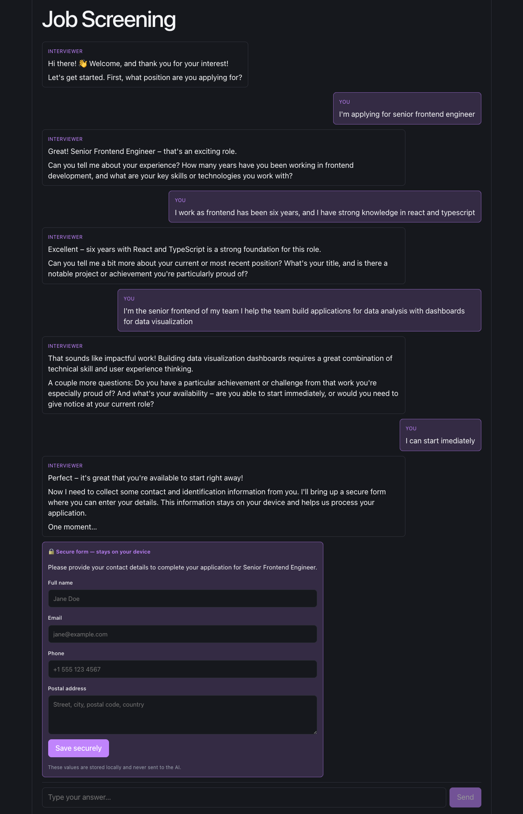
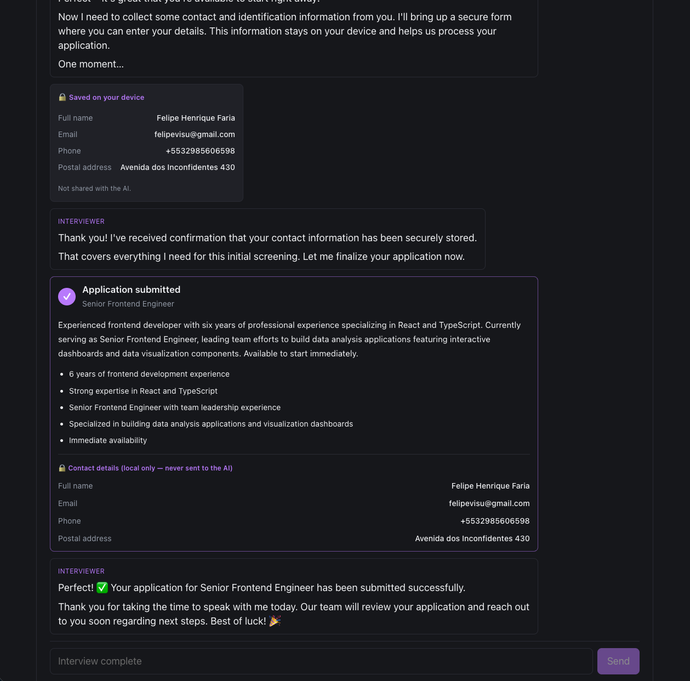

# claude-react-chat-interviewer

React + Vite job-screening chat. Claude (Anthropic SDK) interviews the applicant. When it needs **PII** (name, email, phone, ID/document, address) it renders a **secure inline form** instead of asking in plain text — and the values **never reach the model**.

## Screenshots

**Interview + secure PII form**

The model drives the conversation in text, then calls the tool that renders an inline secure form for personal details.



**Saved locally + application submitted**

Form values are stored on the device (never sent to the model). The final review card merges the model's non-PII summary with the locally-held contact details.



## Setup

```sh
npm install
echo "ANTHROPIC_API_KEY=sk-ant-..." > .env
npm run dev
```

Open http://localhost:5173. The interview auto-starts.

## The problem

An LLM interviewer is useful, but you don't want personal identifiers flowing through the model — for privacy, compliance (GDPR), and audit reasons. Yet the model still needs to *drive* the conversation and know *that* the data was collected.

Split the two:

- **Non-sensitive** (role, experience, skills, availability) → normal chat text to/from Claude.
- **PII** → collected by a React form on the client; Claude only learns *which* fields were filled.

## How it works

### 1. Anthropic proxy (key stays server-side)

Browser uses `@anthropic-ai/sdk` with `baseURL: '/api/anthropic'` and placeholder `apiKey: 'proxy'`. Vite dev server proxies to `https://api.anthropic.com`, injecting `x-api-key` server-side. `ANTHROPIC_API_KEY` never ships in the bundle. See `vite.config.js`.

### 2. Two tools (`src/interview.js`)

- **`collect_personal_info`** — *interactive, no `execute()`*. The system prompt forbids asking for PII in text and tells Claude to call this tool with the `fields` it needs. The UI renders the form; the model gets back only `{ ok: true, collected: ["email", ...] }`.
- **`submit_application`** — runs normally, finalizes with a **non-PII** professional summary and renders the review card.

### 3. The suspend / resume loop (`src/App.jsx`)

The classic tool-use loop, with one twist: an **interactive** tool *pauses* it.

1. Send history + tool schemas to Claude.
2. On `stop_reason === "tool_use"`:
   - `submit_application` → execute immediately, push its `tool_result`.
   - `collect_personal_info` → append a `pii_form` item, **stash the turn**, and `return` (loop suspended). Every `tool_use` in the turn still gets a `tool_result` slot so the protocol stays valid.
3. `handlePiiSubmit` stores the typed values in `profileRef` (client-only), fills the parked turn's `tool_result` with **field keys, not values**, and resumes the loop once all forms are in.

### 4. PII never leaves the client

- Typed values live in `profileRef.current` — a React ref, never put into `messagesRef` (the Anthropic message history).
- The `tool_result` Claude sees contains only `collected: [...keys]` plus a note.
- The final review card (`ApplicationSummary.jsx`) merges the model's professional summary with the PII read from the **local** profile — proving the data was captured even though the model never saw it.

```
applicant types PII ─► profileRef (local)        ─► review card (local render)
                       └► tool_result: {collected:[keys]} ─► Claude
```

## Files

| File | Role |
|------|------|
| `src/interview.js` | System prompt, field catalog, the two tool schemas |
| `src/App.jsx` | Suspend/resume agent loop, local PII profile |
| `src/PiiForm.jsx` | Inline secure form + client-side validation |
| `src/ApplicationSummary.jsx` | Final review card (model summary + local PII) |
| `src/ItemRenderer.jsx` | Maps chat items to components |
