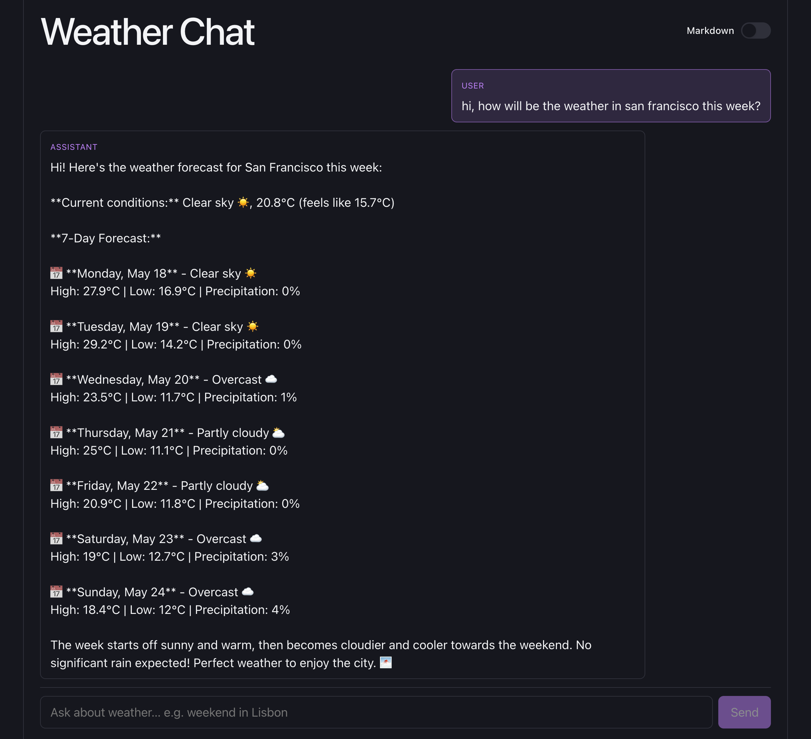
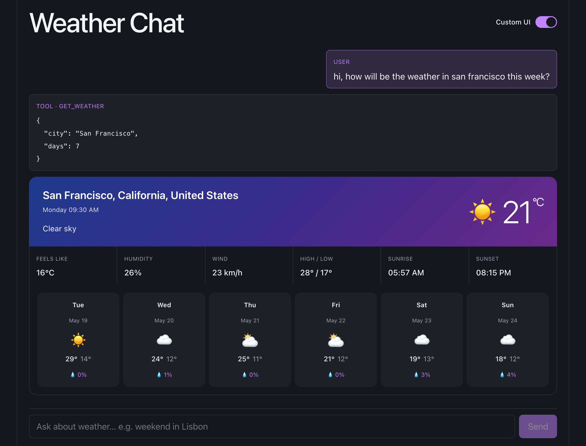

# claude-react-chat

React + Vite weather chat. Claude (Anthropic SDK) + Open-Meteo. Toggle between custom UI and plain markdown to compare a tool-aware renderer vs. a vanilla text chat.

## Screenshots

**Markdown only**



**Custom components**



## Setup

```sh
npm install
echo "ANTHROPIC_API_KEY=sk-ant-..." > .env
npm run dev
```

Open http://localhost:5173.

## What this POC demonstrates

A normal chat shows whatever string the model returns. That is fine for prose, but if you want to render a **rich React component** (a weather card, a chart, a product tile), you need two things:

1. A reliable signal that the model is producing *data* and not prose.
2. Data in a known shape your component can consume.

Claude's **tool use** gives you both for free. This POC wires it end-to-end.

## How it works

### 1. Anthropic proxy (key stays server-side)

- Browser uses `@anthropic-ai/sdk` with `baseURL: '/api/anthropic'` and placeholder `apiKey: 'proxy'`.
- Vite dev server proxies `/api/anthropic/*` → `https://api.anthropic.com/*`, injecting `x-api-key`, `anthropic-version`, and `anthropic-dangerous-direct-browser-access` headers server-side. `Origin`/`Referer` stripped.
- `ANTHROPIC_API_KEY` never ships in the bundle.

See `vite.config.js`.

### 2. The Claude tool: schema as a contract

A tool is declared in `src/tools.js` and passed to `client.messages.create({ tools, ... })`. The schema does two jobs:

- **Tells Claude when to call it** — the `description` is the trigger. Ours says: *"Use whenever the user asks about weather, temperature, rain, snow, or conditions for a place."*
- **Tells Claude what arguments to send** — `input_schema` is JSON Schema. Claude is constrained to produce JSON matching it.

```js
export const getWeatherTool = {
  name: "get_weather",
  description: "Get current weather and multi-day forecast for a city...",
  input_schema: {
    type: "object",
    properties: {
      city: { type: "string", description: "City name, e.g. 'Lisbon'..." },
      days: { type: "integer", minimum: 1, maximum: 16 },
    },
    required: ["city"],
  },
  async execute({ city, days = 7 }) { /* Open-Meteo geocode + forecast */ },
};
```

`execute` is **our** code, not Claude's. Claude only chooses *whether* to call the tool and *what arguments* to send.

### 3. The tool-use loop (`src/App.jsx`)

Tool use is a turn-based protocol. The loop:

1. Send messages + tool schemas to Claude.
2. Response is a list of content blocks. We split them into:
   - `text` blocks → assistant prose.
   - `tool_use` blocks → `{ id, name, input }`.
3. If `stop_reason === "tool_use"`:
   - Append assistant turn (the raw `response.content`) to `messages`.
   - For each `tool_use`, run `toolsByName[name].execute(input)`.
   - Push a `user` turn containing `tool_result` blocks keyed by `tool_use_id`.
   - Loop.
4. Otherwise stop and render the final text.

Claude can chain tools across iterations until it has enough info to answer. The loop handles arbitrarily many rounds.

### 4. Forcing the output shape

This is essential. The `tool_use` block is the **signal** that data — not prose — is coming. The tool's return value is the **data**. We control both:

- The `execute` function returns a tagged object: `{ ok: true, kind: "weather", location, current, daily, units }`.
- `kind: "weather"` is our own discriminator. Claude never invents it — *we* return it.
- `ItemRenderer.jsx` checks `isWeatherPayload(parsed)` and renders `<WeatherCard data={parsed} />` instead of dumping JSON.

So the chat never has to "parse" the model's prose to render the card. The tool result *is* the prop object. Type-safe(ish), no regex, no JSON-from-markdown.