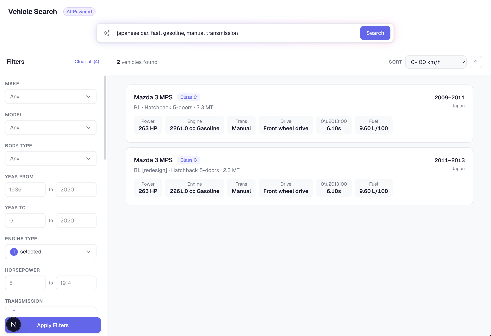
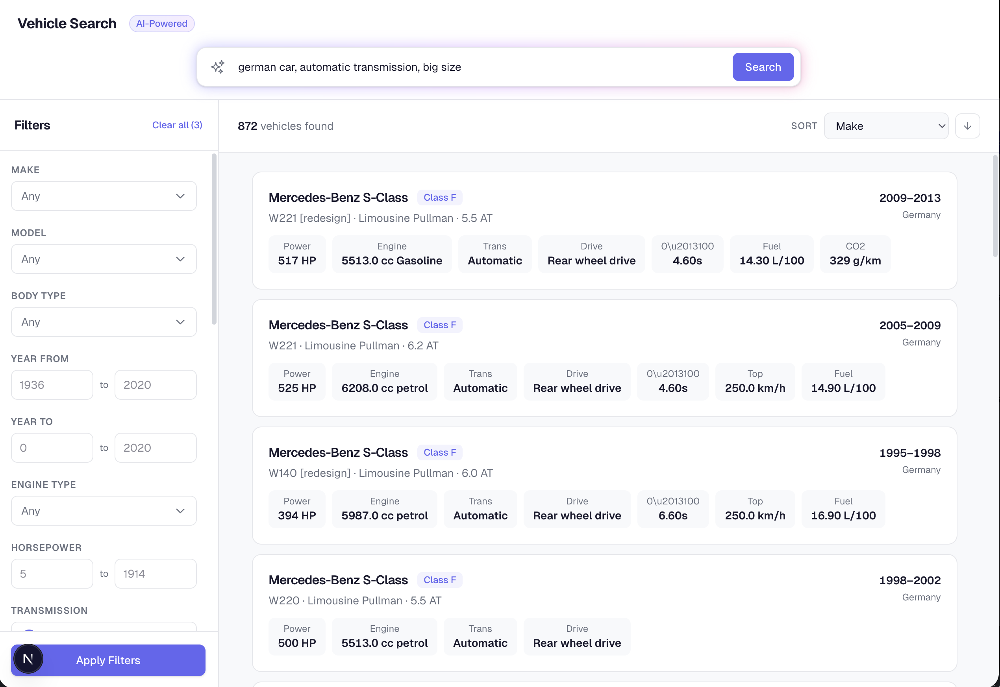

# Input to Filters

A proof of concept that converts natural language into structured API filter payloads using AI. Users type what they're looking for in plain English (e.g. "japanese car, fast, manual transmission") and Claude translates that into the exact filters, ranges, and sort options the backend expects — no manual filter selection needed.

The system prompt includes the full API documentation and OpenAPI spec so the AI knows every available filter, valid value, and range.

## Stack

- **Frontend**: Next.js (search bar + filter sidebar)
- **Backend**: Flask + PostgreSQL (vehicle database with 70k+ trims)
- **AI**: Claude API (natural language to JSON filters)

## Examples

| Screenshot                               | Input                                             | AI-Generated Payload                                                                                                                     |
| ---------------------------------------- | ------------------------------------------------- | ---------------------------------------------------------------------------------------------------------------------------------------- |
|  | japanese car, fast, gasoline, manual transmission | `{"filters":{"country_of_origin":["Japan"],"acceleration_0_100_km_h_s":{"max":7},"engine_type":["Gasoline"],"transmission":["Manual"]}}` |
|  | german car, automatic transmission, big size      | `{"filters":{"country_of_origin":["Germany"],"transmission":["Automatic"],"length_mm":{"min":4600}}}`                                    |
