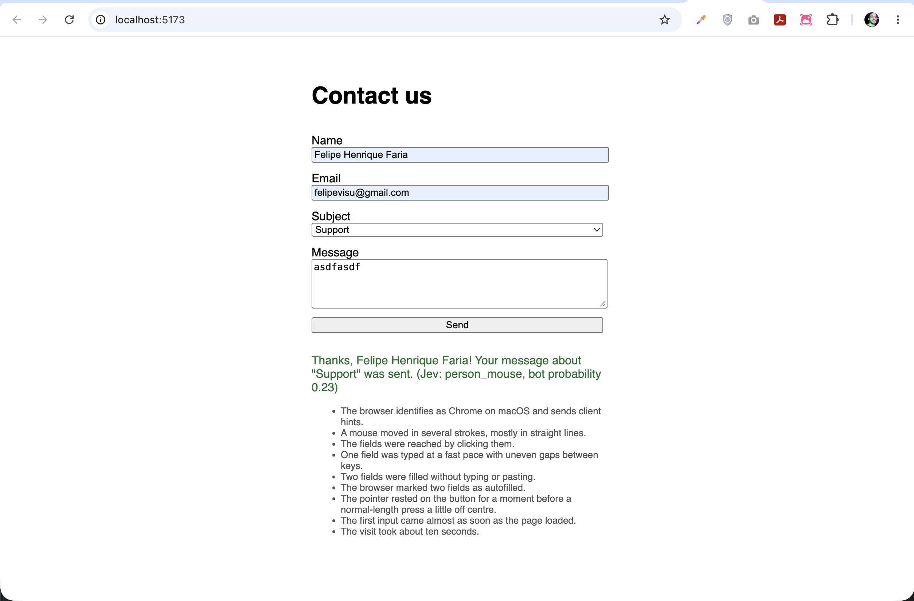
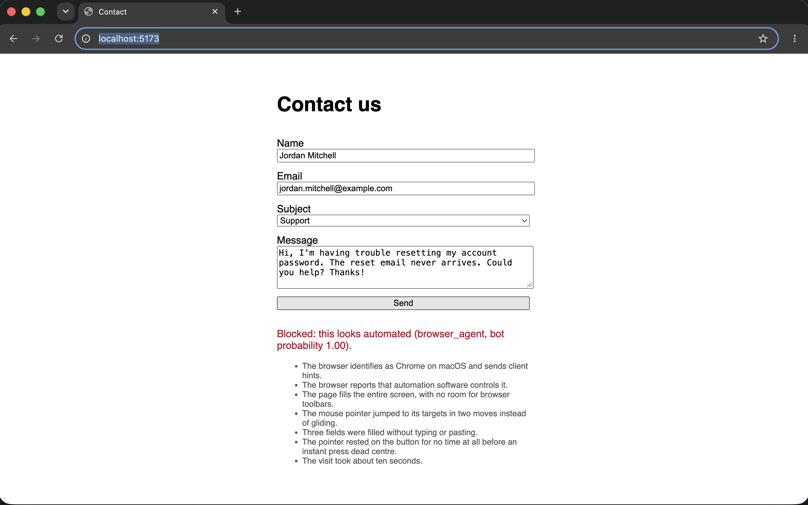
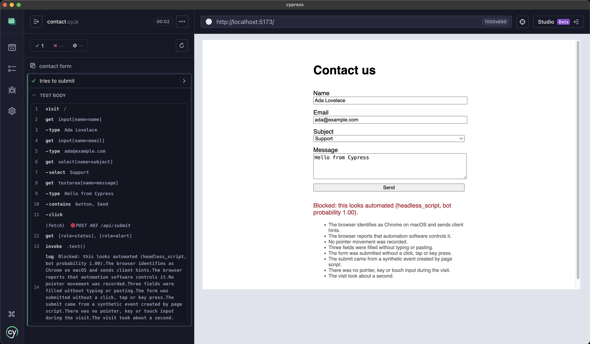
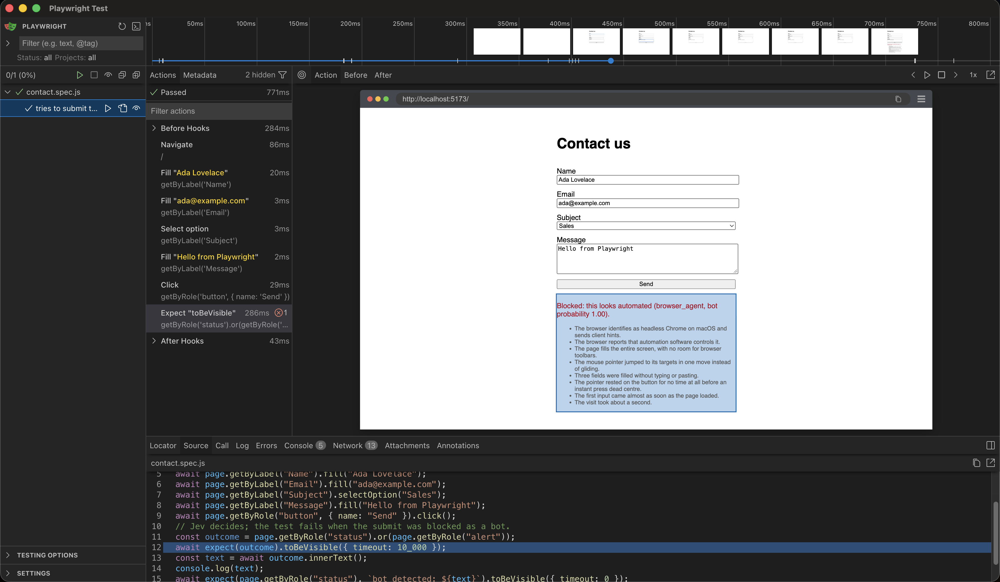

# Jev CAPTCHA

An invisible CAPTCHA for a React contact form: no puzzle. The page measures *how* the form is filled in, turns those measurements into plain sentences, and [Jev](https://docs.typesafe.ai) decides whether a person or a bot wrote them. Bots are blocked.

Three robots try to get through: a Cypress test, a Playwright test, and a Claude agent driving a browser.

Based on Jarek Ceborski's article **[Jev Tutorial: Build Your Own Invisible CAPTCHA (No Puzzles to Solve)](https://www.localcan.com/blog/build-your-own-captcha)** and its code, [LocalCan/invisible-captcha](https://github.com/LocalCan/invisible-captcha) (MIT). The collector, story and signal validation are ported from that repo.

## How it works

```
browser                                   dev server (Vite)                     TypeSafe
───────                                   ─────────────────                     ────────
collector.js counts pointer moves,  ──►   /api/submit                     ──►   Jev picks one:
typing rhythm, button press, focus,       1. validate signals (allowlist)       person_mouse
webdriver flag… (never what's typed)      2. add request facts (UA, hints)      person_touch
                                          3. write the story (sentences)        person_keyboard
                                          4. ask Jev who filled the form        browser_agent
                                          5. pBot ≥ 0.8 → 403 blocked           headless_script
```

Jev reads words, not numbers, so every measurement becomes a phrase, e.g. *"The pointer jumped to its targets in two moves instead of gliding."* The story is the only thing Jev sees. If Jev fails or times out, the visitor gets "try again", never a silent pass.

| Folder | What it is |
| --- | --- |
| `form/` | React contact form + collector, and the `/api/submit` check (`form/server/`) mounted in the Vite dev server |
| `cypress/` | Cypress test that fills and submits the form; fails if blocked |
| `playwright/` | Playwright test that fills and submits the form; fails if blocked |
| `agent/` | Claude (`claude-opus-5-5`) drives Playwright with `read_page` / `fill` / `select` / `click` tools until the form is sent or blocked |

## Run it

```sh
# 1. the form (needs TYPESAFE_API_KEY in form/.env, see form/.env.example)
cd form && npm install && npm run dev        # http://localhost:5173, logs each [jev] verdict + story

# 2. the robots, in another terminal
cd cypress && npm install && npx cypress open    # or: npx cypress run
cd playwright && npm install && npm run ui        # or: npm test / npm run headed
cd agent && npm install && npm run headed         # needs ANTHROPIC_API_KEY in agent/.env
```

Offline check of the signals → story path (no API call): `cd form && node server/selfcheck.js`

Every submit is one Jev call; every agent run is also a Claude run.

## Results

### A person: passes

Mouse moving in strokes, fields reached by clicking, uneven typing, a normal-length press a little off centre. Jev: `person_mouse`, bot probability 0.23.



### Claude agent: blocked

Realistic made-up values, but automation is reported, the pointer teleports, fields are filled without key presses, and the button gets an instant press dead centre. Jev: `browser_agent`, bot probability 1.00.



### Cypress: blocked

No pointer movement at all and the submit comes from a synthetic event. Jev: `headless_script`, bot probability 1.00.



### Playwright: blocked

Headless Chrome, one-move pointer jumps, untyped fields, instant press. Jev: `browser_agent`, bot probability 1.00.



> The Cypress and Playwright screenshots were taken before the tests were changed to fail on a block, so they still show a green check.

## Left out (vs. the article)

- The proof-of-work challenge for uncertain verdicts: here it's only pass or block.
- Rate limiting and session logging.
- The 0.8 block threshold is the article's default, not tuned on real traffic.
- The story and verdict are sent back to the browser for the demo; in production that teaches a bot what to fake.
