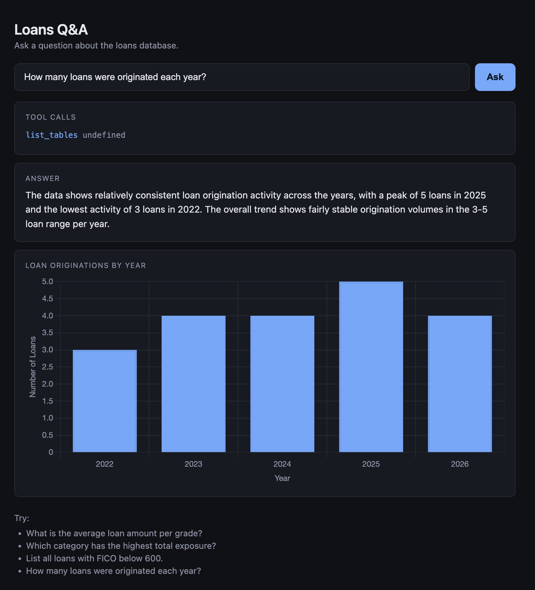

# openrouter-loans

A small POC that lets you ask natural-language questions about a loans database. An LLM (via OpenRouter) is given three SQL tools (`list_tables`, `describe_table`, `run_query`) plus a `render_chart` tool, and figures out which queries to run to answer your question — and which chart, if any, best visualizes the result.

## Stack

- **Postgres 16** — stores the `loans` table, seeded from `init.sql`
- **Express backend** — exposes `POST /api/ask`, orchestrates the agent loop with the OpenRouter Agent SDK
- **Static frontend** — single `index.html` served by nginx, with `/api/*` proxied to the backend; renders charts with [Chart.js](https://www.chartjs.org/) (loaded via CDN)
- All three run via `docker compose`

## Schema

```sql
loans (
  id       SERIAL PRIMARY KEY,
  grade    TEXT    -- p1, p2, p3, p4, p5
  fico     INTEGER -- 0..1000
  term     INTEGER -- 12, 24, 32, 48, 64
  amount   NUMERIC -- > 0
  month    INTEGER -- 0..12
  year     INTEGER -- > 2020
  category TEXT    -- automobile, health, travel, business, house
)
```

20 seed rows covering every grade and category.

## Layout

```
.
├── docker-compose.yml      # postgres + backend + frontend
├── init.sql                # schema + seed data
├── backend/
│   ├── Dockerfile
│   ├── server.js           # Express + OpenRouter agent + pg
│   ├── package.json
│   └── .env                # API_KEY, DATABASE_URL (used for local dev)
└── frontend/
    ├── Dockerfile          # nginx
    ├── nginx.conf          # serves index.html, proxies /api/* to backend
    └── index.html
```

## Run

```bash
docker compose up -d --build
```

Then open http://localhost:8080.

| Service  | URL                       |
|----------|---------------------------|
| Frontend | http://localhost:8080     |
| Backend  | http://localhost:3001     |
| Postgres | postgres://localhost:5432 |

To tear it down (and wipe the database volume):

```bash
docker compose down -v
```

## How it works

1. The user types a question in the frontend and submits it to `POST /api/ask`.
2. The backend calls `callModel` from `@openrouter/agent` with the question and four tools.
3. The model decides which tools to call — typically `list_tables` → `describe_table` → one or more `run_query` SELECTs.
4. If a chart helps, the model also calls `render_chart` with `{ type, title, labels, datasets }`. The backend captures the spec on a request-scoped variable.
5. The backend returns `{ answer, toolCalls, chart }` as JSON.
6. The frontend renders the tool calls, the answer, and (if present) a Chart.js visualization below the answer.

The `run_query` tool rejects anything that isn't a `SELECT`, so the agent can't write to the database. `render_chart` supports `bar`, `line`, `pie`, and `doughnut`.

## Example

Question: *"What is the average loan amount per grade?"*



The agent inspected the schema, ran an aggregation query, and rendered the results as a markdown table with a short interpretation.

## Sample questions to try

- What is the average loan amount per grade?
- Which category has the highest total exposure?
- List all loans with FICO below 600.
- How many loans were originated each year?
- For house loans, what's the FICO distribution by term?
- Are there any p5 loans with FICO above 700 (potential mis-grading)?
