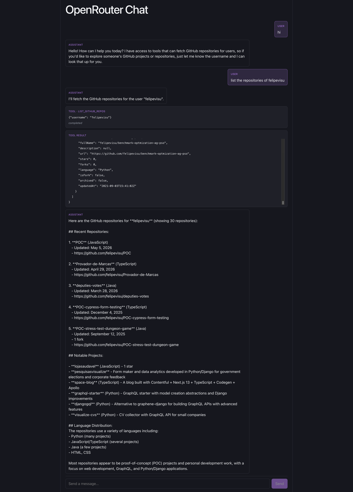

# OpenRouter React Chat

Minimal React + Vite chat UI on top of [`@openrouter/agent`](https://www.npmjs.com/package/@openrouter/agent), with streaming responses and a GitHub-repos tool the model can call.



## What's in here

- **Streaming chat UI** — `getItemsStream()` consumed in `src/App.jsx`, items rendered live by `src/ItemRenderer.jsx`.
- **Item types rendered** — `message` (assistant + user bubbles), `reasoning`, `function_call` (tool args), `function_call_output` (tool result, JSON pretty-printed), `error`.
- **Tool: `list_github_repos`** — defined in `src/tools.js`. When the user asks for someone's repos, the model calls this tool, the SDK runs it against `api.github.com`, and the result streams back into the conversation.
- **CORS-free dev** — Vite dev server proxies `/api/openrouter/*` to `https://openrouter.ai/api/v1/*` and injects the `Authorization` header server-side, so the API key never ships to the browser bundle.

## Run

```bash
npm install
echo "OPENROUTER_API_KEY=sk-or-..." > .env.local
npm run dev
```

Note: `OPENROUTER_API_KEY` (no `VITE_` prefix) — it's read by `vite.config.js` and injected by the dev proxy. Don't expose it to the client.

## File map

- `src/App.jsx` — chat state, input, submit loop
- `src/ItemRenderer.jsx` — per-item-type rendering
- `src/tools.js` — `list_github_repos` tool definition
- `vite.config.js` — `/api/openrouter` → OpenRouter proxy
