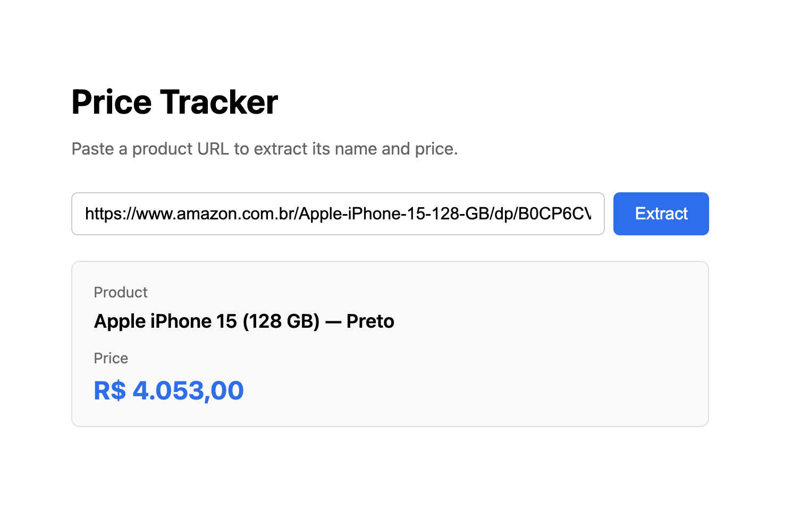

# Price tracker 



This is an AI experiment to extract prices of product pages by extracting it's HTML and asking AI to analyze the page in order to identify the price of the product.

**Motivation:** Web scrappers are hard to write, it starts to fail on every page change and are not flexible. Let's suppose I want to track product price of an Iphone in many different websites, each website would require a different scrapper, with AI we can take advantage of a single implementation.

This kind of tool would be very usefull for people whos seels products in marketplace and want to monitor the concurrency prices.

**Results:** The agent managed to extract the price of many different websites, but it has a high cost due to the token consumpstion.

## Stack

**Next.js:** I used nex.js because it fits with the fullstack requirements this kind of product needs, I can have a client where with a input to type the website and a backend to run the page scrapper and call the AI.

**puppeteer:** This a web browser that I can use to access the required web site and extract the HTML.

## How to run

1. Create a `.env` file with your Anthropic API key:
```
ANTHROPIC_API_KEY=your-key-here
```

2. Install dependencies and start the dev server:
```bash
npm install
npm run dev
```

3. Open http://localhost:3000, paste a product URL, and click **Extract**.