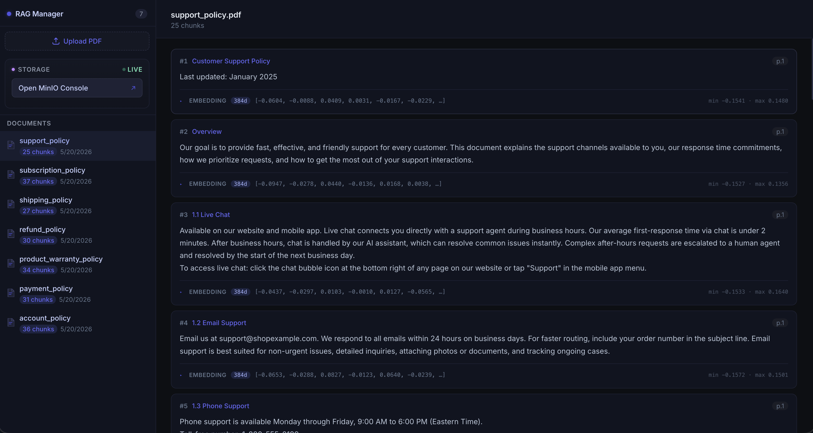
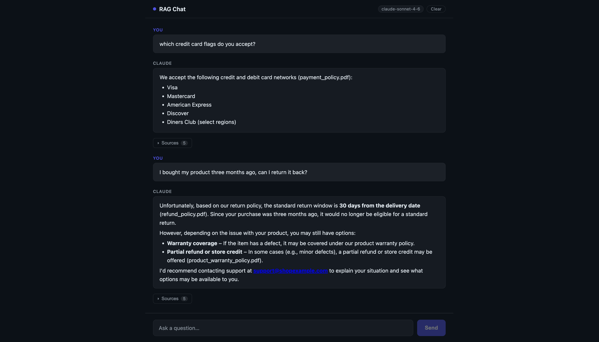

# RAG v2

Upload PDFs and chat with them. Retrieves only relevant chunks before answering — no full-doc context stuffing.

## Screenshots

**Document Manager** — upload PDFs, inspect chunks and embeddings



**Chat UI** — answers grounded in your documents with source citations



---

## Architecture

```
┌─────────────────┐     upload PDF      ┌──────────────┐     webhook     ┌────────────┐
│  documents-ui   │ ─────────────────▶  │ document-api │ ──────────────▶ │   worker   │
│  React · :3000  │                     │ FastAPI·:8000│                 │ FastAPI·:8001
└─────────────────┘                     └──────────────┘                 └────────────┘
                                               │                               │
                                        search │                        chunk + embed
                                               │                               │
┌─────────────────┐     ask question    ┌──────▼──────────────────────────────▼──────┐
│   chat UI       │ ─────────────────▶  │          PostgreSQL + pgvector              │
│  Next.js · :3001│ ◀─────────────────  │          chunks · embeddings · HNSW index  │
└─────────────────┘   answer + sources  └────────────────────────────────────────────┘
```

---

## How It Works

1. **Upload** — PDF saved to MinIO, worker notified via webhook
2. **Chunk** — PDF parsed and split into semantic passages (max 512 tokens each)
3. **Embed** — each chunk converted to a 384-d vector

   ```
   "Items must be returned within 30 days." → [0.0521, -0.1843, 0.3012, ...]

   "How do I get a refund?"       → [0.0489, -0.1901, 0.3144, ...]  ← close
   "Items must be returned..."    → [0.0521, -0.1843, 0.3012, ...]  ← close
   "What are your shipping rates?"→ [-0.1200, 0.2744, -0.0831, ...] ← far
   ```
4. **Store** — chunks + vectors saved in PostgreSQL (HNSW index)
5. **Query** — question vectorized, top-5 matching chunks retrieved
6. **Answer** — Claude answers using only retrieved chunks, returns sources

---

## Services

| Service | Tech | Port | Role |
|---|---|---|---|
| `documents-ui` | React + Vite | 3000 | Upload PDFs, view chunk status |
| `chat` | Next.js | 3001 | Chat interface |
| `document-api` | Python / FastAPI | 8000 | REST API, vector search |
| `worker` | Python / FastAPI | 8001 | PDF parsing, chunking, embedding |
| `postgres` | PostgreSQL 16 + pgvector | 5432 | Chunk and vector storage |
| `minio` | MinIO | 9000 / 9001 | PDF object storage (S3-compatible) |

---

## Running Locally

**Prerequisites:** Docker, Docker Compose, Anthropic API key

```bash
echo "ANTHROPIC_API_KEY=sk-ant-..." > .env
docker compose up --build
# Wait ~3 min for worker to load ML models on first boot
```

| UI | URL |
|---|---|
| Chat | http://localhost:3001 |
| Document manager | http://localhost:3000 |
| MinIO console | http://localhost:9001 (minioadmin / minioadmin) |

Sample PDFs in `documents/pdf/` are auto-uploaded on first boot.
