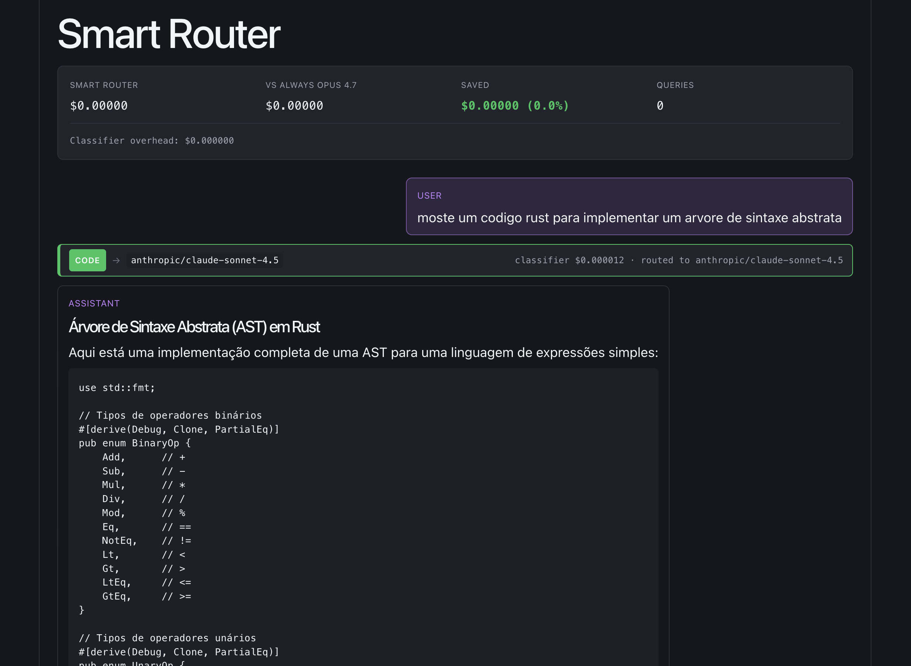
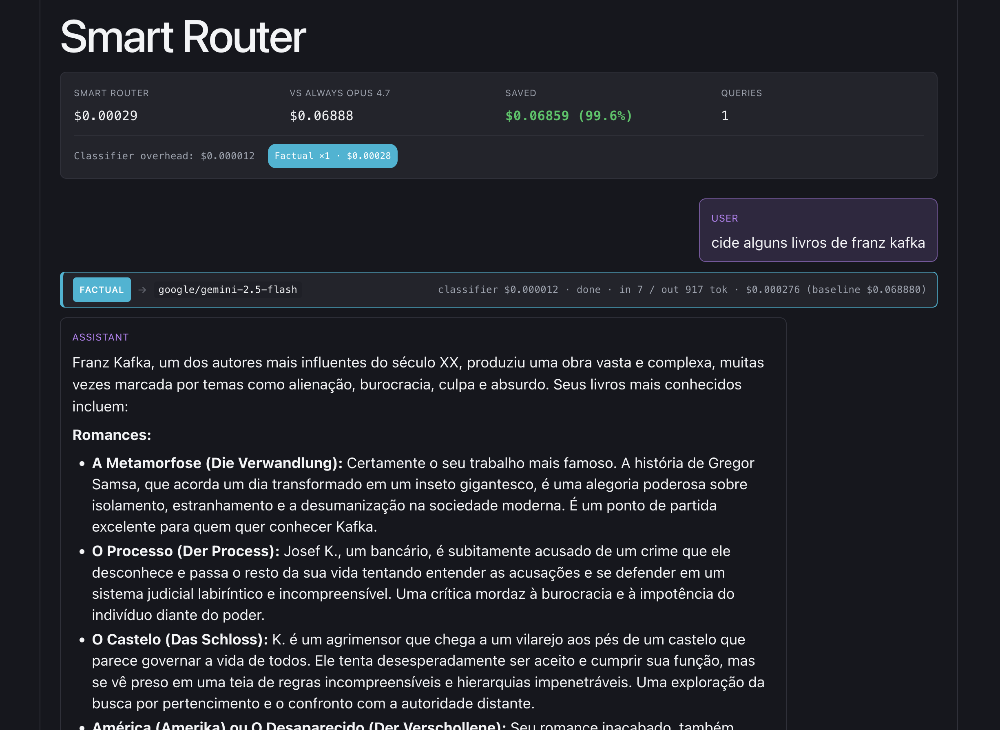

# Smart Router

React + Vite chat. Classifies each prompt, routes to the cheapest model that fits the task, tracks cost vs. always-Opus baseline.

## Buckets

| Bucket    | Model                               |
| --------- | ----------------------------------- |
| code      | `anthropic/claude-sonnet-4.5`       |
| creative  | `anthropic/claude-opus-4.7`         |
| reasoning | `deepseek/deepseek-r1`              |
| factual   | `google/gemini-2.5-flash`           |
| long_doc  | `google/gemini-2.5-pro`             |
| chitchat  | `meta-llama/llama-3.3-70b-instruct` |

Classifier: `google/gemini-2.5-flash` (cheap). Heuristic pre-pass skips classifier on obvious code / long-doc input.

## Screenshots




## Run

```bash
npm install
echo "OPENROUTER_API_KEY=sk-or-..." > .env.local
npm run dev
```

`OPENROUTER_API_KEY` has no `VITE_` prefix — Vite proxy injects it server-side, key never hits the browser bundle.

## Files

- `src/router.js` — buckets, pricing, classifier
- `src/App.jsx` — classify → route → stream
- `src/RouterBadge.jsx` — per-query routing pill
- `src/CostStats.jsx` — running totals + savings
- `src/ItemRenderer.jsx` — markdown-rendered messages
- `vite.config.js` — `/api/openrouter` proxy
