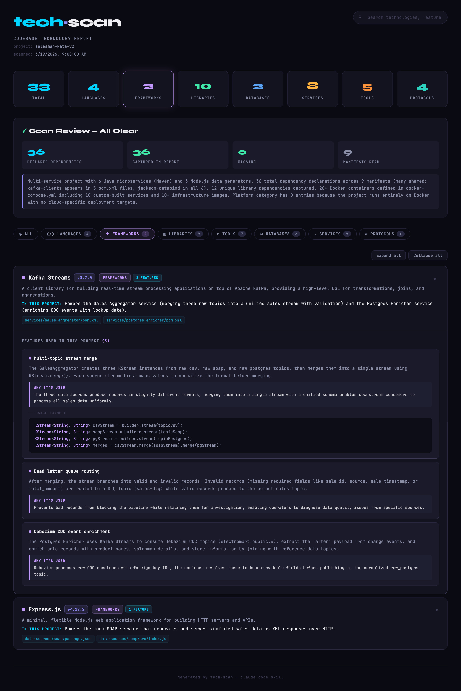

# tech-scan

A Claude Code skill that scans an entire project/repository to discover all technologies in use — languages, frameworks, libraries, databases, services, tools, and protocols.

It reads actual source files, dependency manifests, config files, and infrastructure definitions to produce a comprehensive inventory with rich feature analysis and code examples.

## How to use

1. Copy `SKILL.md` and `template.html` to `~/.claude/skills/tech-scan/`
2. In any project, run the skill via Claude Code:

```
/tech-scan
```

You can also pass a specific path:

```
/tech-scan /path/to/project
```

## What it does

- Reads all dependency manifests (package.json, requirements.txt, go.mod, Cargo.toml, etc.)
- Scans configuration and infrastructure files (Dockerfile, CI/CD pipelines, Terraform, etc.)
- Analyzes source code imports and usage patterns
- Classifies each technology into categories: language, framework, library, database, service, tool, protocol, platform
- Produces a detailed feature analysis with real code examples from the codebase
- Outputs a `tech-scan-data.json` file and an interactive `tech-scan-report.html`

## Output


