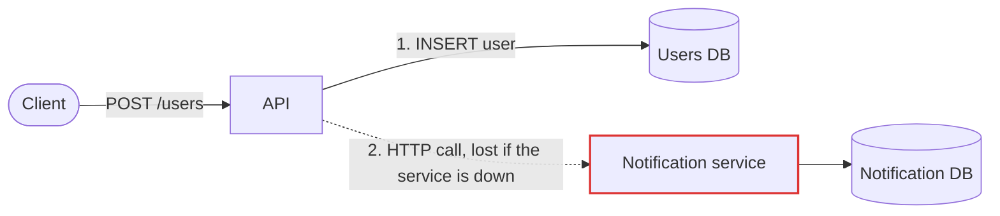
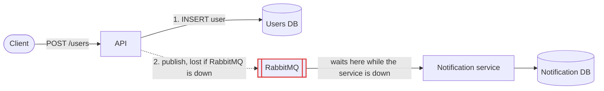
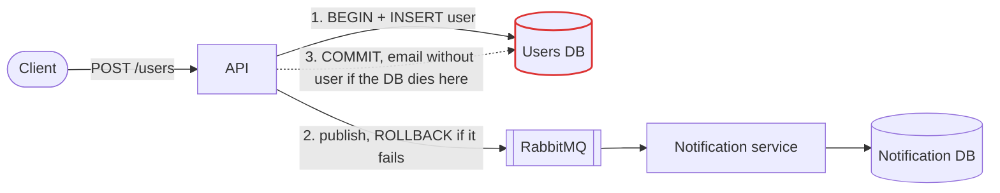
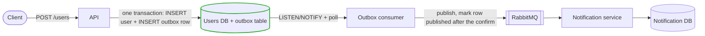

# Dual write

Registering a user needs two things to happen in two different systems: save the user in Postgres, and have the notification service send a welcome email. This is a dual write, and it goes wrong when one side fails and the other does not.

The tests look for two wrong outcomes:

- **User without email:** the user was created, the welcome email was never sent.
- **Email without user:** the welcome email was sent, the user was never created.

Each version tries to fix what the previous one got wrong. A k6 test registers users while one piece of the system is killed and brought back, then `notification/compare.sh` compares the users table against the emails the notification service recorded.

## The four versions

### [Version 1](version1/readme.md) — naive dual write



The API saves the user, then calls the notification service over HTTP. The user is already committed when the call is made, so if the service is down the call fails, nothing retries it, and the user never gets the email.

### [Version 2](version2/readme.md) — queue in the middle



The API publishes to RabbitMQ instead of calling the service. While the notification service is down the messages wait in the queue and are delivered when it returns. But it is still a dual write, now between the database and RabbitMQ: if RabbitMQ is down, the user is saved and the email is never queued.

### [Version 3](version3/readme.md) — publish inside the transaction



The API publishes before committing and rolls the user back if the publish fails, so RabbitMQ being down no longer leaves users without email. But a database transaction cannot include RabbitMQ: if the database dies in the few milliseconds between the publish and the `COMMIT`, the email is already queued and the user is rolled back. It is rare, and it is the opposite failure: an email without a user. Registration also stops working while RabbitMQ is down.

### [Version 4](version4/readme.md) — outbox pattern



The API writes to one system only: the user and an `outbox` row go in the same database transaction, so both exist or neither does. A separate service, the outbox consumer, listens to the database, publishes the pending rows to RabbitMQ and marks a row as published only after RabbitMQ confirms it. Whatever goes down, the email waits and is sent later. The trade-off is that an email can be sent twice.

## Results

Every test registers users for 30 seconds and kills one container from second 10 to second 20 (10 users per second unless noted).

| Version | Test | What is killed | Registered | With an email | User without email | Email without user | Emailed twice |
|---|---|---|---|---|---|---|---|
| 1 | `./load-test.sh` | notification service | 300 | 189 | **111** | 0 | 0 |
| 2 | `notification-down` | notification service | 301 | 301 | 0 | 0 | 0 |
| 2 | `queue-down` | RabbitMQ | 301 | 178 | **123** | 0 | 2 |
| 3 | `./load-test.sh` | version3 database | 199 | 199 | 0 | 0 | 0 |
| 3 | `RATE=100 PHASE=3 ./load-test.sh` | version3 database | 570 | 570 | 0 | **1** | 0 |
| 4 | `queue-down` | RabbitMQ | 301 | 301 | 0 | 0 | 1 |
| 4 | `consumer-down` | outbox consumer | 301 | 301 | 0 | 0 | 0 |
| 4 | `notification-down` | notification service | 301 | 301 | 0 | 0 | 0 |
| 4 | `database-down` | version4 database | 198 | 198 | 0 | 0 | 0 |

- Version 1 loses the email of every user registered while the notification service is down.
- Version 2 fixes that, and loses the email of every user registered while RabbitMQ is down.
- Version 3 fixes that, and can send an email for a user that was never saved. Nothing is slowed down to force it, so it only shows under load (100 users per second, 9 second runs) and only in some runs: 3 of 14.
- Version 4 has neither wrong outcome in any test. Its only flaw is an occasional duplicate email.

The duplicates in versions 2 and 4 are messages that were in flight when RabbitMQ died: the work was done, the confirmation was lost, so the message was delivered again.

## Run

You need Docker and [k6](https://k6.io). Each version's compose file starts everything it needs: the API, its database, the notification service and RabbitMQ. Only one version can run at a time (they share ports), so stop one before starting the next.

```
cd version4
docker compose up -d --build
./load-test.sh queue-down
docker compose stop
```

Each version's readme lists its tests. Every test starts from clean data and prints the k6 summary followed by the comparison.

## Folders

- `version1` to `version4`: the API of each version, its compose file, k6 test and readme.
- `notification`: the fake notification service shared by all versions. It records every request it receives and every email it "sends". It accepts requests over HTTP (version 1) and from the RabbitMQ queue (versions 2 to 4). `compare.sh` lives here too.
