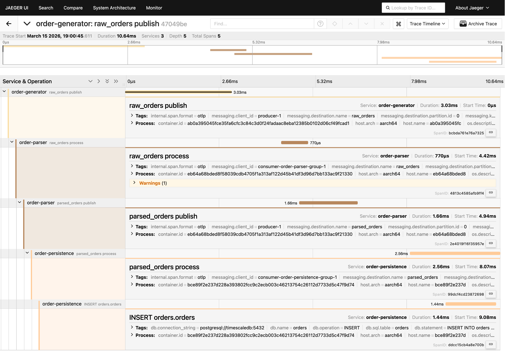

# Order Pipeline with OpenTelemetry

Kafka pipeline with distributed tracing. Orders flow through three Java services — generator → parser → persistence — and every step is traced end-to-end in Jaeger.

## Stack

- Apache Kafka 3.7.1 (KRaft)
- TimescaleDB (PostgreSQL)
- OpenTelemetry Java Agent
- Jaeger

## Running

```bash
docker-compose up --build
```

| Service   | URL                    |
| --------- | ---------------------- |
| Jaeger UI | http://localhost:16686 |
| Kafka UI  | http://localhost:8888  |

## Tracing

Open Jaeger, pick any service and click **Find Traces**. Each trace covers the full journey of one order across all three services.


