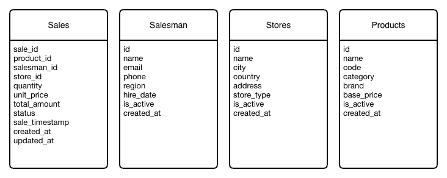

# TOP Salesman - Data KATA

## Problem Context

We are building a software for a Eletronic Store. This store sales cell phones, computers, and relateds.

**Company characteristics:**

* Multi warehouse
* Multi sales person
* Multi retailers

### Problem to solve

Every Monday, the CEO asks:

* "Which cities are generating the most revenue this month?"
* "Who are our top-performing salespeople in each country?"

**Current solution:**

Monday 8:00 AM - CEO asks for the report

Data Analyst Maria does:

1. Export data from PostgreSQL → Excel        (2 hours)
2. Download CSV files from shared folder      (30 min)
3. Manually call bank API for confirmations   (3 hours)
4. Merge everything in Excel                  (4 hours)
5. Create pivot tables and charts             (2 hours)
6. Send email to CEO                          (30 min) 

Wednesday 6:00 PM - Report finally delivered

## Knowledge base

### 1) What is Data Ingestion?

Ingestion is the process of collection and importing data from various sources into your pipeline system for processing. It's a funnel that receives data from many places

```
[Relational DB] ──────┐
                      │
[File System]  ───────┼──▶  [ Your Pipeline ]  ──▶  [Processing]
                      │
[SOAP/WS-*]    ───────┘ 
```

### 2)  What is Data Lineage?

Data Lineage tracks the origin, movement, and transformation of data throughout its lifecycle. It answers:
* Where did this data come from? (origin)
* What happened to it? (transformations)
* Where did it go? (destination)
```
[Raw Sales Data] ──▶ [Cleaned] ──▶ [Aggregated by City] ──▶ [Final DB]
      │                  │                  │                    │
      └──────────────────┴──────────────────┴────────────────────┘
                    Data Lineage Graph (tracked)
```

### 3) What is Message Broker

A Message Broker is middleware that translates and routes messages between different applications/services.

```
┌──────────┐                              ┌──────────┐
│ Producer │ ───▶  ┌────────────────┐ ───▶│ Consumer │
│ (Source) │       │ MESSAGE BROKER │     │ (Target) │
└──────────┘       │    (Kafka)     │     └──────────┘
                   └────────────────┘
                          │
                   • Receives messages
                   • Stores temporarily
                   • Routes to consumers
                   • Guarantees delivery
```

## New Solution

## Diagram


### Data Sources

#### Postgresql

Origin: Original ERP system (SAP on PostgreSQL)<br/>
Data: Real-time sales from POS terminals<br/>
Volume: ~50,000 transactions per day<br/>
Update freq: Real-time (continuous)



#### CSV Files

Origin: Acquired company's legacy system (2018)<br/>
Data: Daily sales export<br/>
Volume: ~10,000 records per file<br/>
Update freq: Once per day (6:00 AM)<br/>
Location: /data/inbox/

```csv
sale_id,product_code,seller_code,amount,city,sale_date
A001,IPHONE15PRO256,SEL042,1199.00,Barcelona,2024-01-15
A002,GALAXYS24ULTRA,SEL018,899.00,Valencia,2024-01-15
A003,MACBOOKPRO14,SEL042,2499.00,Barcelona,2024-01-15
A004,SONYXM5,SEL007,349.00,Lisbon,2024-01-15
A005,LGOLEDC2,SEL023,1899.00,Madrid,2024-01-15
A006,IPADPRO12,SEL018,1099.00,Valencia,2024-01-15
A007,PS5CONSOLE,SEL055,549.00,Milan,2024-01-15
A008,GALAXYTABS9,SEL007,849.00,Lisbon,2024-01-15
A009,AIRPODSPRO2,SEL042,279.00,Barcelona,2024-01-15
A010,DYSONV15,SEL031,699.00,Berlin,2024-01-15
```

#### SOAP

Origin: Bank payment validation service (2012)<br/>
Data: Payment confirmations<br/>
Volume: ~800-1000 confirmations per batch<br/>
Update freq: Polled every 5 minutes<br/>
Protocol: SOAP 1.1 / XML

```
URL: http://bank.com/payment-validation
Method: POST
Content-Type: text/xml
```

## Services needed

| # | Service/Component | Purpose |
|---|-------------------|---------|
| 1 | Relational DB (PostgreSQL) | Source 1 - Sales transactions |
| 2 | File Storage (MinIO/Local) | Source 2 - CSV/JSON files |
| 3 | SOAP Service (Mock WS-*) | Source 3 - Legacy service |
| 4 | Message Broker (Kafka) | Event streaming backbone |
| 5 | Stream Processor (Flink/Kafka Streams) | Processing & aggregation |
| 6 | Lineage Tool (OpenLineage + Marquez) | Track data flow |
| 7 | Observability Stack (Prometheus + Grafana) | Metrics & monitoring |
| 8 | Results Database (ClickHouse/TimescaleDB) | Store aggregated results |
| 9 | REST API (Spring Boot/Go/Node) | Expose results |