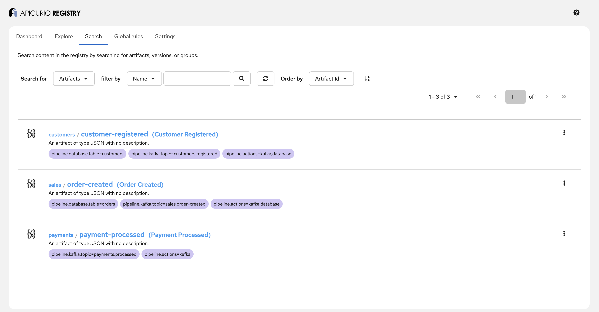
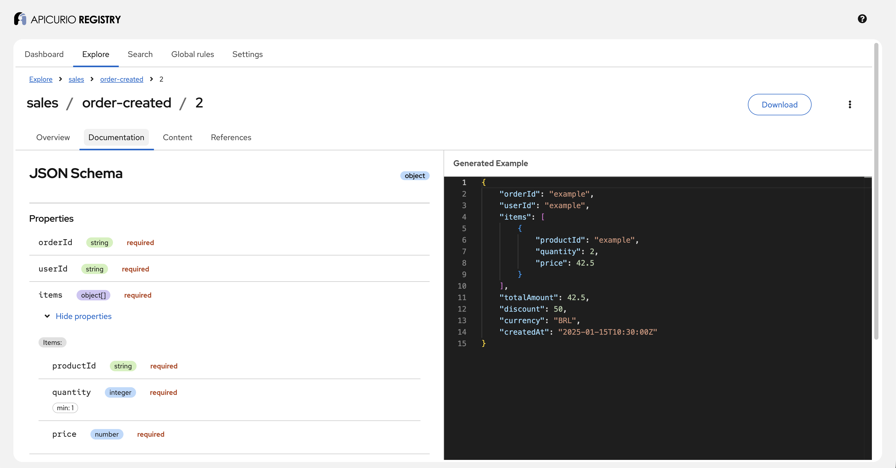
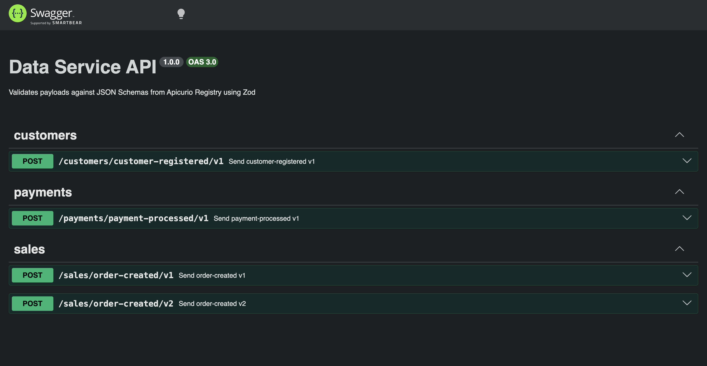

# Data Service API

A Node.js + Express service that reads JSON Schemas from an [Apicurio Schema Registry](https://www.apicurio.io/registry/), generates [Zod](https://zod.dev/) validators at build time, and exposes a versioned POST endpoint per schema for payload validation and data routing.

## How it works

1. **Create schemas and versions:** The data team adds new schemas or versions to the schema registry using the Apicurio UI. They must also add metadata containing information about what to do with the data: persist it in the database or publish it to a Kafka topic;
2. **Schemas endpoint:** Apicurio provides an endpoint where services can fetch all schemas and versions;
3. **Generate:** The data service API retrieves all schemas and versions of Apicurio and, for each one, uses the `json-schema-to-zod` library to generate Zod schema validators;
4. **API:** Express exposes a `POST /{groupId}/{artifactId}/v{version}` endpoint for each Zod schema validator generated in the previous step, this endpoint validates payloads with Zod, if it fails data never joins any pipeline;
5. **Move data to the pipeline**: Execute the data pipeline accordingly to the schema metadata defined on the first step.

## Quick start

```bash
docker-compose up --build
```

| Service           | URL                   | Description              |
| ----------------- | --------------------- | ------------------------ |
| Apicurio Registry | http://localhost:8080 | Schema registry API      |
| Apicurio UI       | http://localhost:8888 | Registry web UI          |
| Data Service API  | http://localhost:3000 | Validation + routing API |

## Schema Registry

The Apicurio Registry UI shows all registered schemas with their pipeline labels:



Each schema has full documentation with property types, constraints, and generated examples:



## Pipeline labels

Each artifact in the registry has **labels** that tell the data service what to do with validated data. Producers don't need to know about this — they just POST data and the service handles the routing.

The data team controls the pipeline by setting labels on the artifact in the registry:

| Label                     | Description                            | Example               |
| ------------------------- | -------------------------------------- | --------------------- |
| `pipeline.actions`        | Comma-separated list of actions to run | `kafka,database`      |
| `pipeline.kafka.topic`    | Kafka topic to publish to              | `sales.order-created` |
| `pipeline.database.table` | Database table to persist to           | `orders`              |

These labels are per-artifact (shared across all versions). Changing the labels in the registry changes the routing without touching the API code — just restart the service.

## Swagger UI

The API is fully documented with OpenAPI. Open http://localhost:3000/docs to explore and test endpoints interactively:



The OpenAPI spec is also available at http://localhost:3000/openapi.json.

## Example request

```bash
curl -X POST http://localhost:3000/sales/order-created/v1 \
  -H "Content-Type: application/json" \
  -d '{
    "orderId": "ORD-001",
    "userId": "USR-123",
    "items": [{"productId": "PROD-1", "quantity": 2, "price": 29.90}],
    "totalAmount": 59.80,
    "createdAt": "2026-03-23T12:00:00Z"
  }'
```

Response — data is validated, then routed through the pipeline:

```json
{
  "valid": true,
  "data": {
    "orderId": "ORD-001",
    "userId": "USR-123",
    "items": [{ "productId": "PROD-1", "quantity": 2, "price": 29.9 }],
    "totalAmount": 59.8,
    "currency": "BRL",
    "createdAt": "2026-03-23T12:00:00Z"
  },
  "pipeline": [
    { "type": "kafka", "status": "sent", "destination": "sales.order-created" },
    { "type": "database", "status": "persisted", "destination": "orders" }
  ]
}
```

Invalid payloads are rejected before reaching the pipeline:

```json
{
  "valid": false,
  "errors": [
    { "code": "invalid_type", "path": ["userId"], "message": "Required" },
    { "code": "invalid_type", "path": ["items"], "message": "Required" }
  ]
}
```

## Adding new schemas

1. Register a new JSON Schema artifact in Apicurio (via UI at http://localhost:8888 or API)
2. Add pipeline labels to the artifact (`pipeline.actions`, `pipeline.kafka.topic`, etc.)
3. Restart the service: `docker compose restart data-service-api`
4. A new `POST /{groupId}/{artifactId}/v{version}` is created with the configured routing
