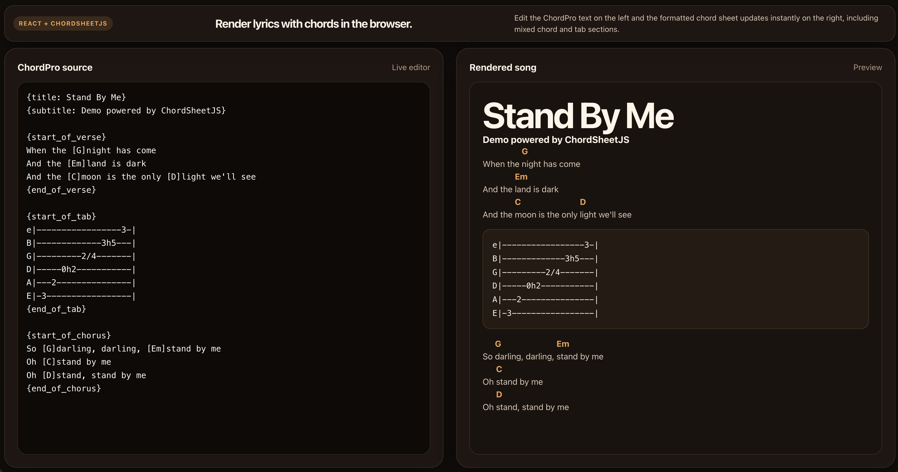

# ChordPro React Demo

This project is a small React + Vite app that uses `chordsheetjs` to render lyrics with chords on screen.

## Features

- Live ChordPro editor
- Instant chord sheet preview
- Responsive two-column layout
- Parse error feedback while editing

## Scripts

- `npm run dev` — start the Vite dev server
- `npm run build` — create a production build
- `npm run lint` — run ESLint
- `npm run preview` — preview the production build

## Main files

- `src/App.jsx` — song editor and ChordSheetJS rendering
- `src/App.css` — component styles
- `src/index.css` — global theme and layout variables
