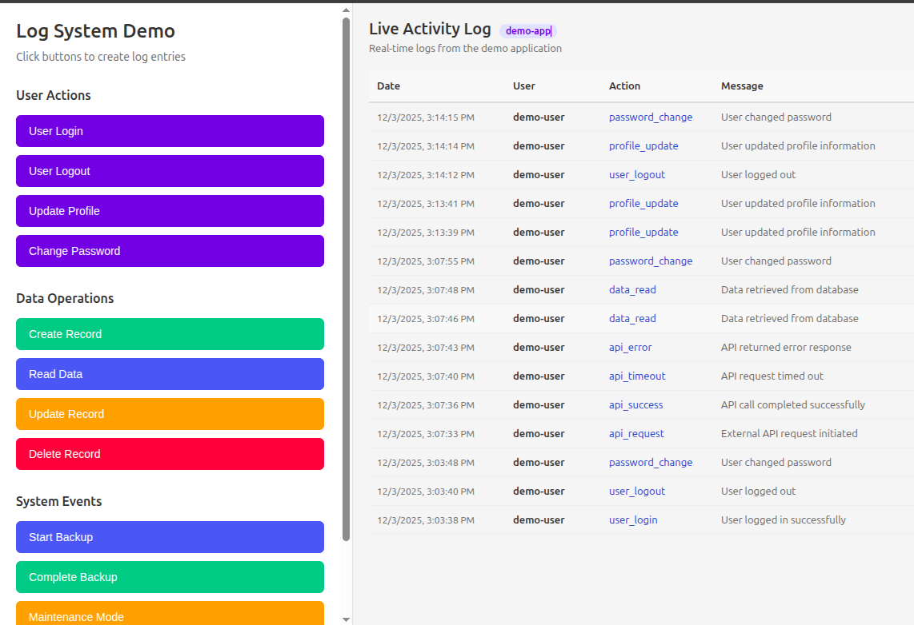

# Log system

This POC creates log system with a reusable component that can be shared across many frontend applications using microfrontend with vite federation plugin.

## Apps

### Backend

Creates a sqlite database to persist user logs.

```bash
cd backend
npm run dev
```

**Create logs**

```bash
curl -X POST http://localhost:3000/api/logs \
  -H "Content-Type: application/json" \
  -d '{"user":"test","application":"app1","action":"login"}'
```

```json
{
  "message": "Log created successfully",
  "log": {
    "id": 17,
    "user": "test",
    "application": "app1",
    "action": "login",
    "date": "2025-12-03 15:20:44",
    "message": null
  }
}
```

**List logs**

```bash
curl GET http://localhost:3000/api/logs?application=app1
```

```json
{
  "logs": [
    {
      "id": 17,
      "user": "test",
      "application": "app1",
      "action": "login",
      "date": "2025-12-03 15:20:44",
      "message": null
    },
    {
      "id": 1,
      "user": "test",
      "application": "app1",
      "action": "login",
      "date": "2025-12-03 14:19:26",
      "message": null
    }
  ],
  "pagination": { "total": 2, "limit": 100, "offset": 0, "hasMore": false },
  "filters": {
    "application": "app1",
    "user": null,
    "action": null,
    "startDate": null,
    "endDate": null
  }
}
```

### Log Ui

Exposes a microfrontend component `LogComponent` using vite federation plugin.

```bash
cd log-ui
npm run build
npm run preview
```

### Example App

App that creates logs and consumes the `LogComponent` from the microfrontend.

```bash
cd exmaple-app
npm run dev
```


