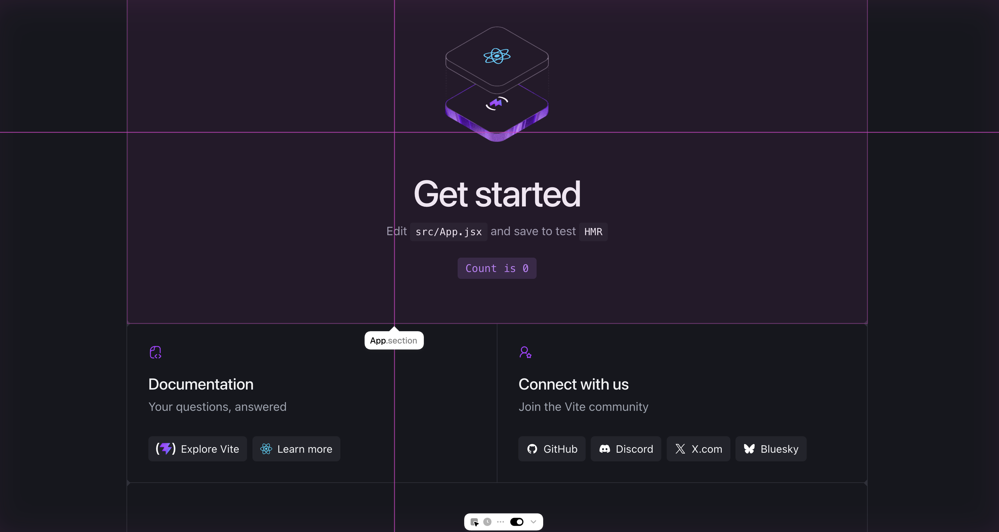

# React grab

React Grab lets you select context for coding agents directly from your website.



**Install**

```bash
npm install react-grab
```

**Setup**
`src/main.jsx`

```js
if (import.meta.env.DEV) {
  import("react-grab");
}
```
