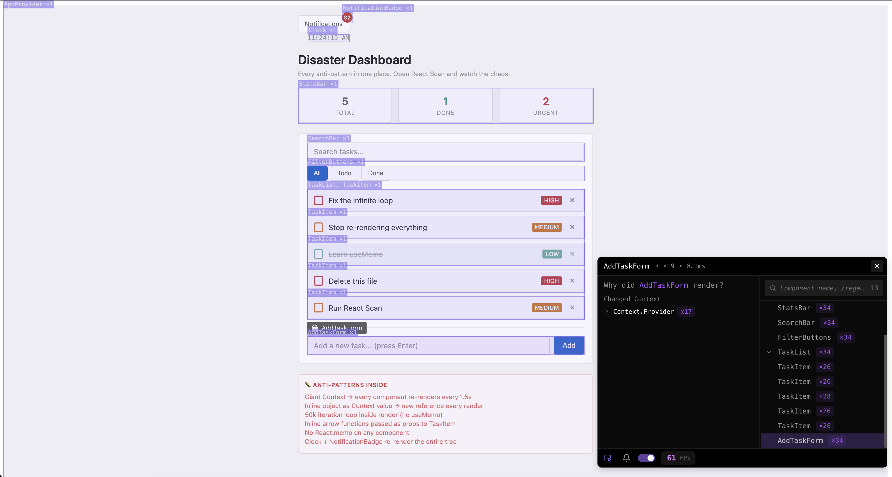

# Anti patterns wi evaluate with react scan

* Big Context → every component re-renders every 1.5s
* Inline object as Context value → new reference every render
* 50k iteration loop inside render (no useMemo)
* Inline arrow functions passed as props to TaskItem
* No React.memo on any component
* Clock + NotificationBadge re-render the entire tree

