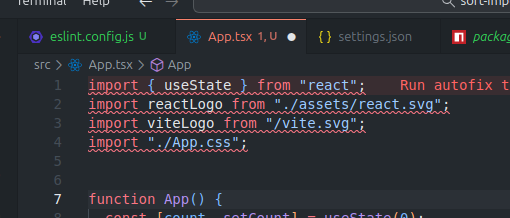
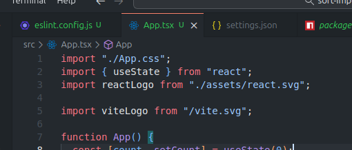

## Sort Imports

### Setup

**Install lint libraries**

```bash
npm install -D eslint-plugin-import eslint-plugin-simple-import-sort
```

**Setup eslint config (eslint.config.js)**

```js
import simpleImportSort from "eslint-plugin-simple-import-sort";

export default [
  {
    plugins: {
      "simple-import-sort": simpleImportSort,
    },
    rules: {
      "simple-import-sort/imports": [
        "error",
        {
          groups: [
            // Combine everything into fewer groups to avoid spacing
            [
              // Side effects (CSS)
              "^\\u0000",
              // React
              "^react",
              // External packages
              "^@?\\w",
              // Internal packages
              "^(@|components|utils|config|services)(/.*|$)",
              // Parent and relative imports
              "^\\.\\.(?!/?$)",
              "^\\.\\./?$",
              "^\\./(?=.*/)(?!/?$)",
              "^\\.(?!/?$)",
              "^\\./?$",
            ],
          ],
        },
      ],
      "simple-import-sort/exports": "error",
    },
  },
];
```

**VS Code (.vscode/settings.json)**

```json
{
  "editor.codeActionsOnSave": {
    "source.fixAll.eslint": "explicit"
  },
  "eslint.validate": [
    "javascript",
    "javascriptreact",
    "typescript",
    "typescriptreact"
  ]
}
```

### Results

**Before**



**After**


