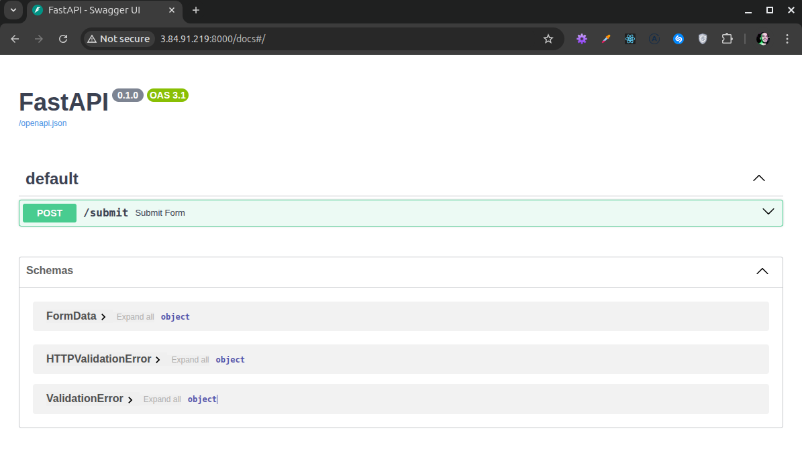

# Rest API host on AWS using Terraform

This is my Hello World in Infrastructure as Code using Terraform to deploy a FastAPI application on AWS EC2.

The application is REST API that accepts a post on `/submit`.

**Request**

```json
{
  "name": "John Doe",
  "email": "john-doe@email.com",
  "phone": "+1234567890",
  "message": "Hello, this is a test message."
}
```

**Response**

```json
{ "status": "success", "message": "Form received" }
```

## Technologies used

- FastAPI
- Docker
- Terraform
- EC2

## How to deploy

### Step 1

Before deploying, you must verify your email address in AWS SES:

```bash
# Verify sender email
aws ses verify-email-identity --email-address <your_email>

# Check verification status
aws ses get-identity-verification-attributes --identities <your_email>
```

### Step 2: Configure your variables

```bash
# Copy the example file
cp terraform.tfvars.example terraform.tfvars

# Edit with your actual email
# Make sure the email is verified in SES first!
```

Edit `terraform.tfvars`:

```hcl
sender_email = <your_email>
recipient_email = <your_email>
```

### Step 3: Generate SSH key (Help to debug but is not recommended for production)

```bash
ssh-keygen -t rsa -b 2048 -f fastapi-key
```

### Step 4: Create infra

```bash
cd infra
terraform init
terraform apply
```

## How to debug

**See the outputs**

```bash
terraform output
```

It should return

```bash
fastapi_public_dns = "ec2-3-93-148-97.compute-1.amazonaws.com"
fastapi_public_ip = "3.93.148.97"
fastapi_url = "http://3.93.148.97:8000"
instance_public_dns = "ec2-3-93-148-97.compute-1.amazonaws.com"
instance_public_ip = "3.93.148.97"
```

**Access EC2 using ssh**

```bash
ssh -i ~/.ssh/fastapi-key ubuntu@3.93.148.97
```

**Check if the use-data ran successfuly**

```bash
sudo cat /var/log/user-data.log
```

## Results



### Next steps

- Use AWS SES to send the form data via email;
- Use SQS to queue the form data;
