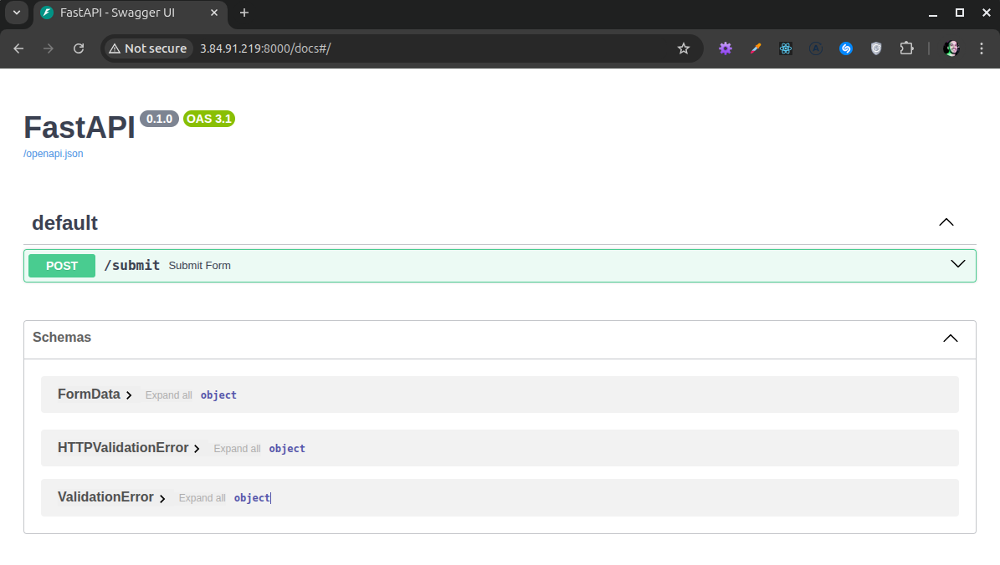

## Rest API host on AWS using Terraform

This is my Hello World in Infrastructure as Code using Terraform to deploy a FastAPI application on AWS EC2.

The application is REST API that accepts a post on `/submit`.

**Request** 
```json
{
  "name": "John Doe",
  "email": "john-doe@email.com",
  "phone": "+1234567890",
  "message": "Hello, this is a test message."
}
```

**Response** 
```json
{"status": "success", "message": "Form received"}
```

### Technologies used
* FastAPI
* Docker
* Terraform
* EC2


### How to deploy

```bash
cd infra
terraform init
terraform apply
```

### Results



### Next steps

* Use AWS SES to send the form data via email;
* Use SQS to queue the form data;