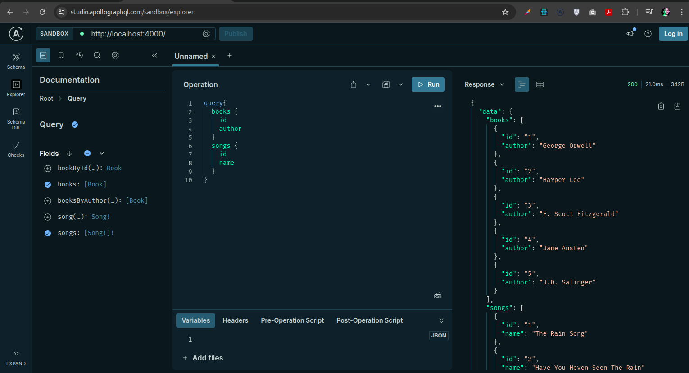

# Federation GRAPHQL POC

Run with docker compose

```bash
docker compose up -d --build
```

## APP 1 (Radio) - Python

The first app exposes an API to retrieve a list of songs.

**http://localhost:8000/graphql**

```graphql
query {
  songs {
    id
    name
    band
  }
}
```

```graphql
{
  "data": {
    "songs": [
        {
            "id": "1",
            "name": "The Rain Song",
            "band": "Led Zeppeling"
        },
        {
            "id": "2",
            "name": "Have You Heven Seen The Rain",
            "band": "Creedence"
        },
        {
            "id": "3",
            "name": "Shine On You Crazy Diamond",
            "band": "Pink Floyd"
        }
    ]
  }
}
```

## APP 2 (Library) - Java

The second app exposes an API to retrieve a list books.

**http://localhost:8080/graphql**

```graphql
query {
  books {
    id
    title
    author
  }
}
```

```graphql
{
  "data": {
    "books": [
        {
            "id": "1",
            "title": "1984",
            "author": "George Orwell"
        },
        {
            "id": "2",
            "title": "To Kill a Mockingbird",
            "author": "Harper Lee"
        },
        {
            "id": "3",
            "title": "The Great Gatsby",
            "author": "F. Scott Fitzgerald"
        },
    ]
  }
}
```

## APP 3 - Javascript Apollo

The thrid app mixes the two API's into one.

**http://localhost:4000**


