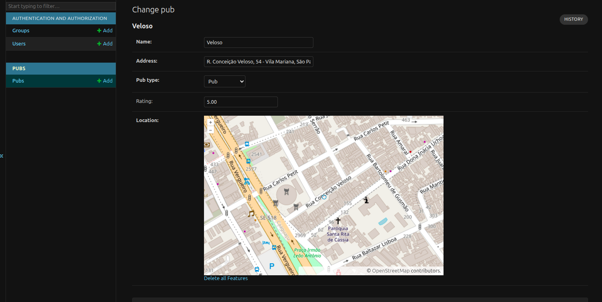
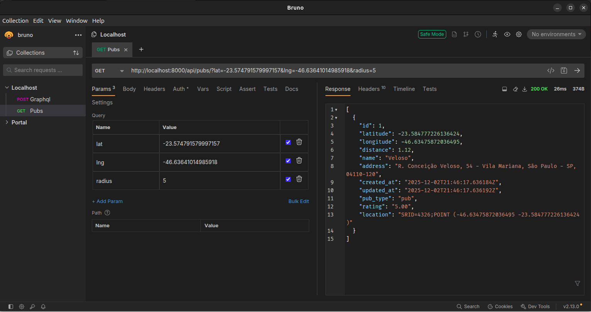
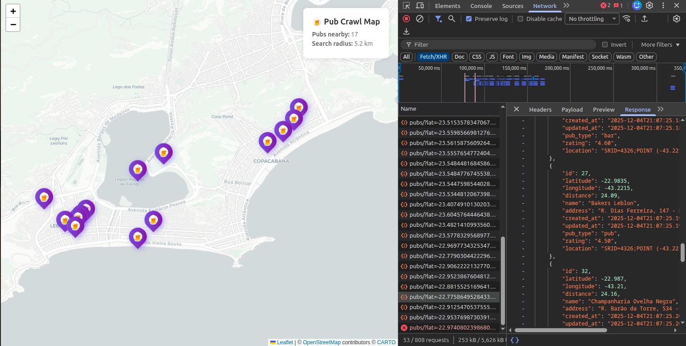

# Pub Crawl with Django and PostGis

This POC implements an endpoint where is possible to retrieve a list os pubs based on user location.

The database stores the Pubs by latitude and longitude and the endpoint filters the pubs based on a initial location and ratio of x kilometers.

## How to run

```bash
docker compose up --build
```

**Load sample data**

```bash
docker compose exec web python manage.py load_sample_data
```

## Access

### Admin

http://localhost:8000/admin

**User:** admin
**Password:** admin123



### Endpoint

**Example of query:**

http://localhost:8000/api/pubs/?lat=-23.574791579997157&lng=-46.63641014985918&radius=5



### Web

http://localhost:3000


